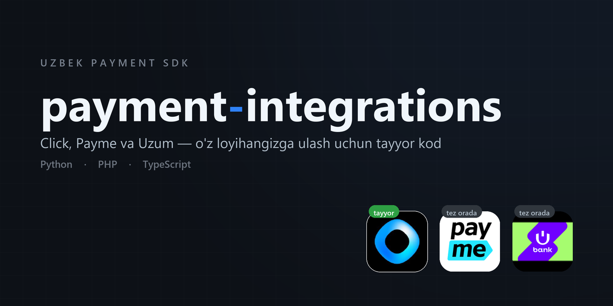

# payment-integrations

<p align="center">
  
</p>

O'zbekiston to'lov tizimlarini **o'z loyihangizga** qo'shish uchun tayyor kod.

Har bir integratsiya uch tilda: **Python**, **PHP**, **TypeScript**. Kutubxona
o'rnatish shart emas — papkani ko'chirasiz, `.env` ni to'ldirasiz, bitta faylni
bazangizga bog'laysiz.

```
papkani ko'chir  →  .env ni to'ldir  →  bitta faylni bazangizga bog'la  →  tayyor
```

---

## Nima bor

| To'lov tizimi | Python | PHP | TypeScript | Holati |
|---|:---:|:---:|:---:|---|
| [**Click**](click) (my.click.uz) | [✅](click/python) | [✅](click/php) | [✅](click/typescript) | Tayyor |
| Payme | — | — | — | Rejada |
| Uzum Bank | — | — | — | Rejada |

### Click

Merchant API — `prepare` / `complete`. Imzo tekshiruvi, takroriy callback
himoyasi, atomar to'lov belgilash.

| | Qo'llab-quvvatlaydi | Testlar |
|---|---|---|
| [**Python**](click/python) | FastAPI, Flask, Django · PostgreSQL, MySQL, SQLite | 21 |
| [**PHP**](click/php) | Oddiy hosting, Laravel, Slim · MySQL, PDO | 42 |
| [**TypeScript**](click/typescript) | Next.js, Express, Hono · Prisma, Drizzle | 26 |

---

## AI bilan ulash

Har bir papkada `AI_PROMPT.md` bor — AI uchun to'liq ko'rsatma. Loyihangizda
Claude Code, Cursor yoki Copilot ishlatsangiz, shunchaki ayting:

```
click/python papkasidagi AI_PROMPT.md ni o'qi va Click to'lovini
loyihamga to'liq ulab ber.
```

AI loyihangizni o'rganadi, bazangizga bog'laydi, endpoint'larni qo'shadi,
migratsiya yozadi va tekshiradi. Ko'rsatmada eng ko'p uchraydigan xatolar
(atomar `mark_paid`, auth middleware, imzodagi xom `amount`) qat'iy qoida qilib
yozilgan — AI ularda qoqilmaydi.

---

## Nega bu kerak

To'lov integratsiyasida uchta joyda xato qilish oson, uchalasi ham qimmatga
tushadi:

**1. Takroriy callback.** Click javobni ololmasa so'rovni qayta yuboradi —
ba'zan bir vaqtda. Agar buyurtmani "to'landi" qilishda shartni oldin kodda
tekshirib, keyin yozsangiz, ikkala so'rov ham o'tib ketadi va **mahsulot ikki
marta beriladi**. To'g'ri yo'l — shartni bazaning o'ziga qo'yish:

```sql
UPDATE orders SET status='paid' WHERE id=? AND status='pending'
```

va o'zgargan qatorlar sonini qaytarish. Hamma integratsiya shu tamoyilga
qurilgan.

**2. Imzodagi `amount`.** Click `"5000.00"` yuboradi. Uni `float` ga o'girib
qaytarsangiz `"5000"` bo'ladi va imzo mos kelmaydi — hamma to'lov `-1` bilan
rad etiladi. Kod `amount` ga tegmaydi.

**3. Yopiq endpoint.** Callback Click serveridan keladi — u sizning tizimingizga
login qila olmaydi va CSRF token yubormaydi. Global auth middleware bo'lsa,
Click 403 oladi va to'lovlar umuman ishlamaydi.

---

## Xavfsizlik

- `.env` hech qachon git'ga tushmaydi (`.gitignore` da).
- `secret_key` kodda ham, loglarda ham, to'lov havolasida ham yo'q — testlar
  buni alohida tekshiradi.
- Imzo `hash_equals` / `timingSafeEqual` bilan solishtiriladi.
- `action` so'rovdan olinmaydi — endpoint o'zi belgilaydi, shuning uchun
  `prepare` uchun olingan imzoni `complete` ga qo'yib bo'lmaydi.
- Summa har doim bazadan tekshiriladi.

Agar `secret_key` ommaga chiqib ketsa — Click kabinetidan darhol yangilang.

---

## Litsenziya

[MIT](LICENSE) — erkin ishlating.

Foydali bo'lsa ⭐ qo'ying. Xato topsangiz yoki boshqa to'lov tizimi kerak bo'lsa
— [issue](https://github.com/shamsiyevshamsiddin19/payment-integrations/issues)
oching.
